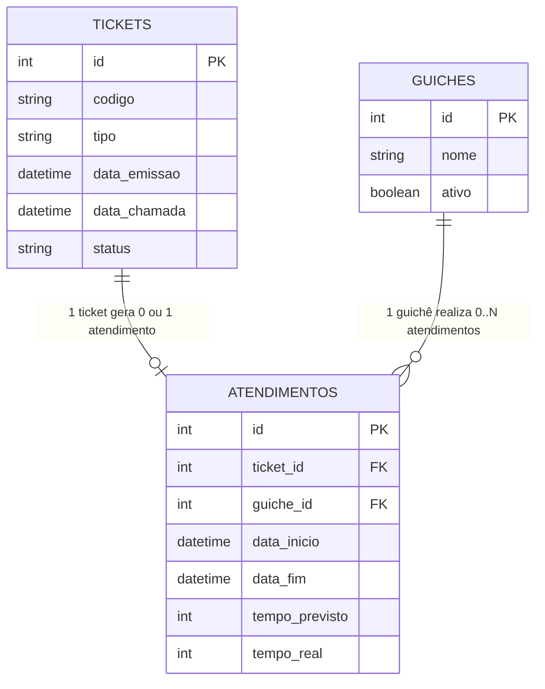

# MobileTicketsIonic

```mermaid
erDiagram

    TICKETS {
        int id PK
        string codigo
        string tipo
        datetime data_emissao
        datetime data_chamada
        string status
    }

    GUICHES {
        int id PK
        string nome
        boolean ativo
    }

    ATENDIMENTOS {
        int id PK
        int ticket_id FK
        int guiche_id FK
        datetime data_inicio
        datetime data_fim
        int tempo_previsto
        int tempo_real
    }

    TICKETS ||--o| ATENDIMENTOS : "1 ticket gera 0 ou 1 atendimento"
    GUICHES ||--o{ ATENDIMENTOS : "1 guichê realiza 0..N atendimentos"


```
